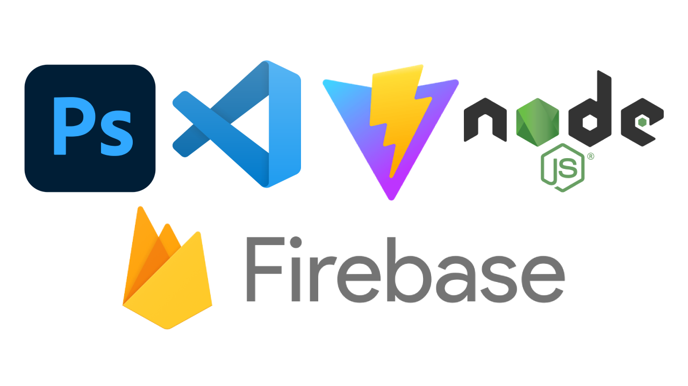

<h1 align="center"> Vynil Store (E-Commerce Example) - Proyecto Final React JS - Coderhouse</h1>
 

 Ejemplo de sitio web E-Commerce de merchandising de música (CDs, Vinilos, etc.). Desarrollado con React.js, JSX, HTML5, CSS3, Node.js, Chakra UI, Tailwind CSS y GIT. Photoshop CS6 para diseños y Vite JS para ejecución.

<h3><bold><em>GIF Presentación / GIF Presentation</h3></bold></em>

# Autor / Author - Mateo Leotta Meier

 

[LinkedIn](https://www.linkedin.com/in/mateoleottameier/)

Proyecto Final Carrera de Desarrollo Front-End en Coderhouse.

Final Project Front-End Development Career at Coderhouse.

## Descripción / Description
Ejemplo de sitio web E-Commerce de merchandising de música (CDs, Vinilos, etc.).

Example of an E-Commerce website for music merchandising (CDs, Vinyl, etc.).

## Tecnologías / Tecnology

## Software

 <h1 align="center">Copyright ®Meier 2023</h1>